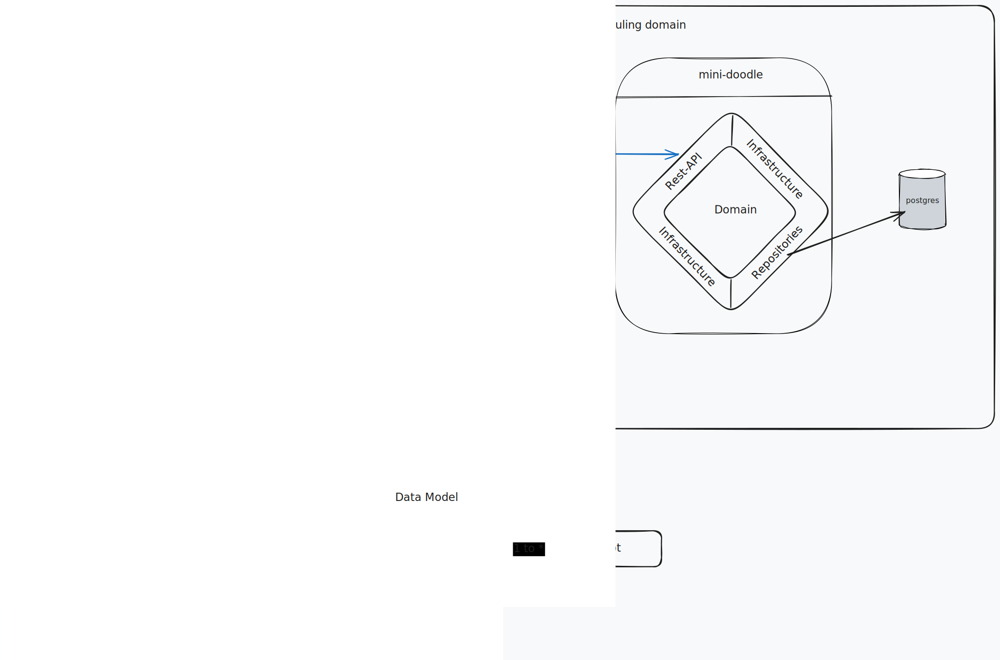

# mini-doodle
Mini doodle application with calendar, slots and meetings organisation


## How to run it locally
The application is built using `gradle`. The current files include a gradle wrapper
that can be used to build the application. To do this execute the following command:

```bash
./gradlew build
```

Once the build is successful, you can run the application using the docker compose 
configuration, which includes a PostgreSQL database and a Jaeger instance for observability.

```bash
docker compose up
```

## Observability with Jaeger
The docker compose file includes Jaeger for local observability. In order to
access the server locally go to `http://localhost:16686/`

## How to interact with the application
Once the application is running, you can interact with it using the following endpoints:

It's important to note that all date time and duration values are using the ISO 8601 format.

- `POST /users/` => Create a new user. Needed to do all subsequent operations.
- `POST /users/{userId}/slots` => Create a new slot for the user. An example of the body can be found below:
```json
{
  "startTime": "2025-06-03T00:00:00Z",
  "duration": "PT1H",
  "availability": "AVAILABLE"
}
```
- `POST /users/{userId}/slots/{slotId}/makeAvailable` => Switches the slot to available.
- `POST /users/{userId}/slots/{slotId}/makeUnavailable` => Switches the slot to unavailable.
- `PUT /users/{userId}/slots/{slotId}` => Updates the slot. An example of the body can be found below:
```json
{
  "startTime": "2025-06-04T10:00:00Z",
  "duration": "PT2H",
  "availability": "UNAVAILABLE"
}
```
- `DELETE /users/{userId}/slots/{slotId}` => Deletes the slot.
- `POST /users/{userId}/slots/{slotId}/toMeeting` => Transforms the slot into a meeting.
- `PUT /users/{userId}/meetings/{meetingId}/` => Allows to update the title, description and participants of a meeting. 
An example of the body can be found below:
```json
{
  "title": "Important meeting",
  "description": "If you miss this meeting you're gonna get fired",
  "participants": ["b6661e74-8b2d-4460-9c13-60e94c1c79a6", "b6661e74-8b2d-4460-9c13-60e94c1c79a7", "b6661e74-8b2d-4460-9c13-60e94c1c79a8"]
}
```
- `GET /users/{userId}/calendar` => Returns the calendar including slots and meetings for a given user.

## Design
The application is designed using the Hexagonal Architecture (also known as Ports and Adapters). A small diagram
showing the high level architecture can be found below:


## Future improvements
- Make the slot transformation into a meeting transactional.
- Validate that all participants of a meeting are real users.
- Additional tests. (Kept very simple for lack of extra time)
